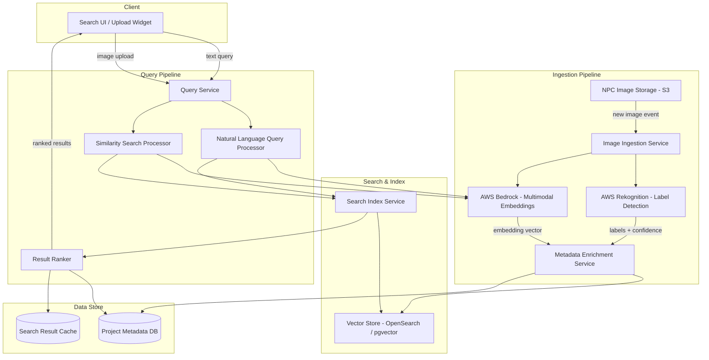
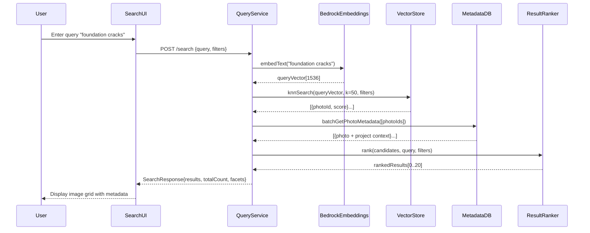
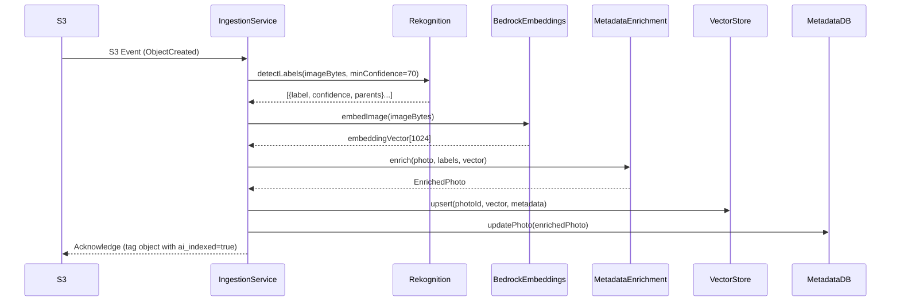
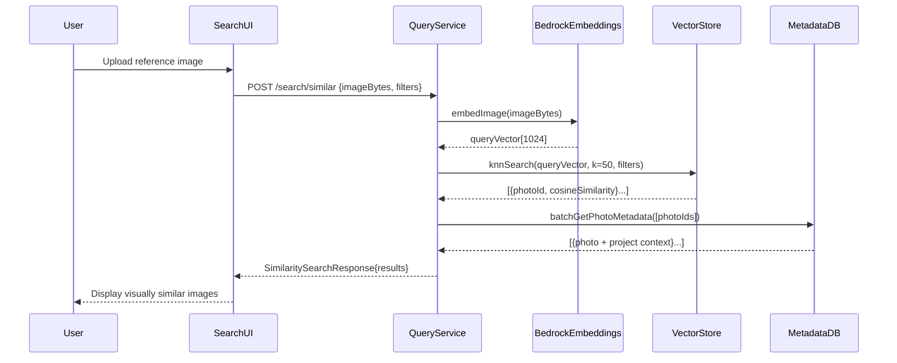

# Design Document: Visual Project Intelligence Search

## Overview

Visual Project Intelligence Search is an AI-powered image search system for construction and engineering project teams. It uses computer vision (AWS Rekognition) and semantic embeddings (AWS Bedrock) to automatically tag, index, and retrieve project site photos based on natural language queries or visual similarity — eliminating the need to rely on filenames or manual browsing.

The system integrates with NPC's existing project image storage, enriching each photo with AI-generated labels and vector embeddings at ingest time. At query time, users describe what they are looking for in plain English (e.g., "foundation cracks" or "steel beam connection") or upload a reference image, and the system returns ranked, contextually linked results filtered by project, date, location, or detected objects.

The design targets three measurable outcomes: a 60% reduction in image-location time, a 25% increase in cross-project image reuse, and a 40% improvement in first-attempt search success rate.

---

## Architecture



---

## Sequence Diagrams

### Natural Language Search Flow



### Image Ingestion Flow



### Similarity Search Flow



---

## Components and Interfaces

### Component 1: Image Ingestion Service

**Purpose**: Orchestrates the pipeline that processes newly uploaded project images — calling Rekognition for labels, Bedrock for embeddings, and persisting enriched metadata.

**Interface**:
```pascal
INTERFACE ImageIngestionService
  PROCEDURE ingestImage(event: S3Event): IngestionResult
  PROCEDURE reindexImage(photoId: String): IngestionResult
  PROCEDURE batchIngest(photoIds: List<String>): BatchIngestionResult
END INTERFACE
```

**Responsibilities**:
- Listen for S3 ObjectCreated events via EventBridge or SQS
- Coordinate calls to Rekognition and Bedrock in parallel where possible
- Persist enriched photo records to MetadataDB and VectorStore
- Tag S3 objects with `ai_indexed=true` upon successful indexing
- Handle partial failures with retry logic and dead-letter queue

---

### Component 2: Query Service

**Purpose**: Accepts search requests (text or image), converts them to embedding vectors, queries the vector store, and returns ranked, metadata-enriched results.

**Interface**:
```pascal
INTERFACE QueryService
  PROCEDURE searchByText(request: TextSearchRequest): SearchResponse
  PROCEDURE searchBySimilarity(request: SimilaritySearchRequest): SearchResponse
  PROCEDURE getFilters(projectId: String): FilterOptions
END INTERFACE
```

**Responsibilities**:
- Parse and validate incoming search requests
- Route to NLP processor (text) or Similarity processor (image)
- Apply smart filters (project, date range, location, detected objects)
- Merge vector search scores with metadata relevance signals
- Return paginated, ranked results with thumbnail URLs and project context

---

### Component 3: Metadata Enrichment Service

**Purpose**: Combines raw AI outputs (labels, vectors) with existing project metadata to produce a unified enriched photo record.

**Interface**:
```pascal
INTERFACE MetadataEnrichmentService
  PROCEDURE enrich(photo: RawPhoto, labels: List<Label>, vector: EmbeddingVector): EnrichedPhoto
  PROCEDURE updateTags(photoId: String, tags: List<String>): Void
END INTERFACE
```

**Responsibilities**:
- Merge Rekognition labels with user-supplied tags
- Construct a natural-language AI description from labels and project context
- Normalize confidence scores and filter low-confidence labels (< 70%)
- Link photo to project, document, and location metadata

---

### Component 4: Search Index Service

**Purpose**: Manages the vector store index — handling upserts, deletes, and filter-aware kNN queries.

**Interface**:
```pascal
INTERFACE SearchIndexService
  PROCEDURE upsert(photoId: String, vector: EmbeddingVector, metadata: PhotoMetadata): Void
  PROCEDURE delete(photoId: String): Void
  PROCEDURE knnSearch(queryVector: EmbeddingVector, k: Integer, filters: SearchFilters): List<SearchCandidate>
END INTERFACE
```

**Responsibilities**:
- Maintain vector index in OpenSearch (k-NN plugin) or pgvector
- Support pre-filter by project, date range, and label
- Return cosine similarity scores alongside photo IDs
- Handle index refresh and consistency with MetadataDB

---

## Data Models

### Model 1: RawPhoto

```pascal
STRUCTURE RawPhoto
  photoId:     String        // UUID, system-generated
  filename:    String        // original filename (e.g., "site-photo-01.jpg")
  s3Key:       String        // S3 object key
  projectId:   String        // e.g., "PROJ-001"
  projectName: String        // e.g., "Harbor Bridge Reconstruction"
  dateTaken:   DateTime      // ISO 8601
  takenBy:     String        // photographer name
  location:    String        // site location description
  tags:        List<String>  // user-supplied tags (may be empty)
END STRUCTURE
```

**Validation Rules**:
- `photoId` must be a valid UUID
- `s3Key` must reference an accessible S3 object
- `projectId` must exist in the project registry
- `dateTaken` must not be in the future

---

### Model 2: EnrichedPhoto

```pascal
STRUCTURE EnrichedPhoto EXTENDS RawPhoto
  aiLabels:       List<Label>      // Rekognition output
  aiDescription:  String           // generated natural-language description
  embeddingVector: List<Float>     // 1024-dimension Bedrock multimodal embedding (Titan Multimodal v1)
  indexedAt:      DateTime         // when AI indexing completed
  indexVersion:   Integer          // embedding model version
END STRUCTURE

STRUCTURE Label
  name:       String   // e.g., "Bridge", "Concrete", "Crack"
  confidence: Float    // 0.0 - 100.0
  parents:    List<String>  // Rekognition parent categories
END STRUCTURE
```

**Validation Rules**:
- `embeddingVector` must have exactly 1536 dimensions
- `aiLabels` must only include labels with confidence >= 70.0
- `indexVersion` must match the current active embedding model version

---

### Model 3: TextSearchRequest

```pascal
STRUCTURE TextSearchRequest
  query:      String          // natural language query, 1-500 chars
  filters:    SearchFilters   // optional filter criteria
  page:       Integer         // 0-based page index, default 0
  pageSize:   Integer         // 1-50, default 20
END STRUCTURE

STRUCTURE SearchFilters
  projectIds:    List<String>  // filter to specific projects
  dateFrom:      DateTime      // inclusive start date
  dateTo:        DateTime      // inclusive end date
  locations:     List<String>  // location keywords
  detectedLabels: List<String> // filter by AI-detected object labels
END STRUCTURE
```

**Validation Rules**:
- `query` must be non-empty and <= 500 characters
- `pageSize` must be between 1 and 50
- `dateFrom` must be before or equal to `dateTo` when both are provided

---

### Model 4: SearchResponse

```pascal
STRUCTURE SearchResponse
  results:    List<SearchResult>  // ranked photo results
  totalCount: Integer             // total matching photos
  page:       Integer
  pageSize:   Integer
  facets:     SearchFacets        // aggregated filter options
  queryId:    String              // UUID for analytics/feedback
END STRUCTURE

STRUCTURE SearchResult
  photo:          EnrichedPhoto
  score:          Float           // relevance score 0.0-1.0
  thumbnailUrl:   String          // pre-signed S3 URL
  projectContext: ProjectContext  // linked project info
END STRUCTURE

STRUCTURE ProjectContext
  projectId:   String
  projectName: String
  documentLinks: List<String>  // related document URLs
END STRUCTURE
```

---

## Algorithmic Pseudocode

### Main Text Search Algorithm

```pascal
PROCEDURE searchByText(request: TextSearchRequest)
  INPUT: request of type TextSearchRequest
  OUTPUT: response of type SearchResponse

  SEQUENCE
    // Precondition: request is valid
    ASSERT request.query IS NOT NULL AND LENGTH(request.query) > 0
    ASSERT request.pageSize >= 1 AND request.pageSize <= 50

    // Step 1: Check cache
    cacheKey ← buildCacheKey(request)
    cached ← cache.get(cacheKey)
    IF cached IS NOT NULL THEN
      RETURN cached
    END IF

    // Step 2: Embed the query text
    queryVector ← bedrockClient.embedText(request.query)
    ASSERT LENGTH(queryVector) = 1536

    // Step 3: Build filter predicate
    filters ← buildVectorFilters(request.filters)

    // Step 4: kNN search in vector store
    candidates ← vectorStore.knnSearch(queryVector, k=50, filters)
    ASSERT LENGTH(candidates) >= 0

    // Step 5: Fetch metadata for candidates
    photoIds ← MAP(candidates, c => c.photoId)
    photos ← metadataDB.batchGet(photoIds)

    // Step 6: Rank and paginate
    ranked ← rankResults(candidates, photos, request.query)
    page ← paginate(ranked, request.page, request.pageSize)

    // Step 7: Build response
    facets ← computeFacets(ranked)
    response ← SearchResponse {
      results:    page,
      totalCount: LENGTH(ranked),
      page:       request.page,
      pageSize:   request.pageSize,
      facets:     facets,
      queryId:    generateUUID()
    }

    // Postcondition: response is valid and paginated correctly
    ASSERT response.results IS NOT NULL
    ASSERT LENGTH(response.results) <= request.pageSize

    cache.set(cacheKey, response, TTL=300)
    RETURN response
  END SEQUENCE
END PROCEDURE
```

**Preconditions**:
- `request.query` is non-null and non-empty
- `request.pageSize` is between 1 and 50
- Bedrock embedding service is available
- Vector store index is populated

**Postconditions**:
- Returns a valid `SearchResponse`
- `results` length <= `pageSize`
- All results have valid `thumbnailUrl` and `projectContext`
- `queryId` is a unique UUID for analytics tracking

**Loop Invariants**: N/A (no explicit loops; batch operations are atomic)

---

### Image Ingestion Algorithm

```pascal
PROCEDURE ingestImage(event: S3Event)
  INPUT: event of type S3Event
  OUTPUT: result of type IngestionResult

  SEQUENCE
    // Precondition: event references a valid, accessible image
    ASSERT event.bucket IS NOT NULL
    ASSERT event.key IS NOT NULL

    // Step 1: Load image bytes and existing metadata
    imageBytes ← s3Client.getObject(event.bucket, event.key)
    rawPhoto ← metadataDB.getByS3Key(event.key)

    IF rawPhoto IS NULL THEN
      RETURN IngestionResult { status: SKIPPED, reason: "No metadata record found" }
    END IF

    // Step 2: Run Rekognition and Bedrock in parallel
    PARALLEL
      labels ← rekognition.detectLabels(imageBytes, minConfidence=70.0)
      vector ← bedrock.embedImage(imageBytes)
    END PARALLEL

    ASSERT LENGTH(vector) = 1536
    ASSERT labels IS NOT NULL

    // Step 3: Filter low-confidence labels
    filteredLabels ← FILTER(labels, l => l.confidence >= 70.0)

    // Step 4: Generate AI description
    description ← buildDescription(rawPhoto, filteredLabels)

    // Step 5: Enrich and persist
    enriched ← EnrichedPhoto {
      ...rawPhoto,
      aiLabels:        filteredLabels,
      aiDescription:   description,
      embeddingVector: vector,
      indexedAt:       now(),
      indexVersion:    CURRENT_MODEL_VERSION
    }

    metadataDB.upsert(enriched)
    vectorStore.upsert(enriched.photoId, vector, buildIndexMetadata(enriched))
    s3Client.tagObject(event.bucket, event.key, { ai_indexed: "true" })

    // Postcondition: photo is fully indexed
    ASSERT metadataDB.exists(enriched.photoId)
    ASSERT vectorStore.exists(enriched.photoId)

    RETURN IngestionResult { status: SUCCESS, photoId: enriched.photoId }
  END SEQUENCE
END PROCEDURE
```

**Preconditions**:
- S3 event references an accessible image object
- A `RawPhoto` metadata record exists for the S3 key
- Rekognition and Bedrock services are reachable

**Postconditions**:
- `EnrichedPhoto` record exists in MetadataDB with AI labels and description
- Embedding vector is stored in VectorStore under `photoId`
- S3 object is tagged with `ai_indexed=true`
- Returns `IngestionResult` with `SUCCESS` or `SKIPPED` status

**Loop Invariants**: N/A

---

### Result Ranking Algorithm

```pascal
PROCEDURE rankResults(candidates: List<SearchCandidate>, photos: Map<String, EnrichedPhoto>, query: String)
  INPUT: candidates (vector search results with scores), photos (metadata map), query (original text)
  OUTPUT: rankedResults of type List<SearchResult>

  SEQUENCE
    rankedResults ← EMPTY LIST

    FOR each candidate IN candidates DO
      // Loop invariant: all previously processed candidates have valid scores
      ASSERT candidate.score >= 0.0 AND candidate.score <= 1.0

      photo ← photos[candidate.photoId]
      IF photo IS NULL THEN
        CONTINUE  // skip orphaned vector entries
      END IF

      // Compute composite score
      vectorScore   ← candidate.score                          // cosine similarity
      labelBoost    ← computeLabelBoost(photo.aiLabels, query) // 0.0 - 0.2
      recencyBoost  ← computeRecencyBoost(photo.dateTaken)     // 0.0 - 0.1
      compositeScore ← vectorScore + labelBoost + recencyBoost

      thumbnailUrl ← s3Client.presignUrl(photo.s3Key, expiry=3600)
      projectCtx   ← projectRegistry.getContext(photo.projectId)

      result ← SearchResult {
        photo:          photo,
        score:          MIN(compositeScore, 1.0),
        thumbnailUrl:   thumbnailUrl,
        projectContext: projectCtx
      }

      rankedResults.append(result)
    END FOR

    // Sort descending by composite score
    SORT rankedResults BY score DESCENDING

    // Postcondition: results are sorted and all scores are valid
    ASSERT ALL(r => r.score >= 0.0 AND r.score <= 1.0, rankedResults)
    ASSERT isSortedDescending(rankedResults, r => r.score)

    RETURN rankedResults
  END SEQUENCE
END PROCEDURE
```

**Preconditions**:
- `candidates` is a non-null list from vector store kNN search
- `photos` map contains metadata for all candidate photo IDs
- `query` is the original user search string

**Postconditions**:
- Returns list sorted by composite score descending
- All scores are clamped to [0.0, 1.0]
- Results with missing metadata are excluded

**Loop Invariants**:
- All previously appended results have valid composite scores
- `rankedResults` length <= `candidates` length at every iteration

---

## Key Functions with Formal Specifications

### buildCacheKey()

```pascal
FUNCTION buildCacheKey(request: TextSearchRequest): String
```

**Preconditions**:
- `request.query` is non-null and non-empty

**Postconditions**:
- Returns a deterministic string key
- Two requests with identical query and filters produce the same key
- Two requests with different queries produce different keys

---

### computeLabelBoost()

```pascal
FUNCTION computeLabelBoost(labels: List<Label>, query: String): Float
```

**Preconditions**:
- `labels` is non-null (may be empty)
- `query` is non-null and non-empty

**Postconditions**:
- Returns a Float in range [0.0, 0.2]
- Returns 0.0 if no label names appear in the query
- Higher confidence label matches produce higher boost values

---

### buildDescription()

```pascal
FUNCTION buildDescription(photo: RawPhoto, labels: List<Label>): String
```

**Preconditions**:
- `photo` is non-null with valid `projectName` and `location`
- `labels` is non-null (may be empty)

**Postconditions**:
- Returns a non-empty natural-language description string
- Description includes project name, location, and top-3 label names
- Description length is <= 500 characters

---

## Example Usage

```pascal
// Example 1: Natural language search with project filter
request ← TextSearchRequest {
  query:    "foundation cracks",
  filters:  SearchFilters { projectIds: ["PROJ-001"] },
  page:     0,
  pageSize: 20
}
response ← queryService.searchByText(request)
DISPLAY response.results  // ranked photos of foundation cracks from Harbor Bridge project

// Example 2: Similarity search using an uploaded image
imageBytes ← readFile("reference-crack.jpg")
simRequest ← SimilaritySearchRequest {
  imageBytes: imageBytes,
  filters:    SearchFilters { dateFrom: "2024-01-01" }
}
simResponse ← queryService.searchBySimilarity(simRequest)
DISPLAY simResponse.results  // visually similar images across all projects

// Example 3: Ingestion triggered by S3 event
event ← S3Event { bucket: "npc-project-images", key: "PROJ-001/site-photo-01.jpg" }
result ← ingestionService.ingestImage(event)
IF result.status = SUCCESS THEN
  DISPLAY "Indexed: " + result.photoId
ELSE
  DISPLAY "Skipped: " + result.reason
END IF

// Example 4: Filtered search by detected label
request ← TextSearchRequest {
  query:   "steel beam",
  filters: SearchFilters {
    detectedLabels: ["Steel", "Beam"],
    dateFrom: "2024-04-01",
    dateTo:   "2024-06-30"
  },
  pageSize: 10
}
response ← queryService.searchByText(request)
```

---

## Correctness Properties

- **Embedding Consistency**: For any image I, `embedImage(I)` always returns a vector of exactly 1024 dimensions (Titan Multimodal v1). Text queries use Titan Text v2 and return 1536 dimensions.
- **Label Confidence Threshold**: For all labels L stored in an `EnrichedPhoto`, `L.confidence >= 70.0`.
- **Search Monotonicity**: For any query Q, adding more restrictive filters to a search request never increases `totalCount`.
- **Score Bounds**: For all `SearchResult` R returned by any search, `0.0 <= R.score <= 1.0`.
- **Ingestion Idempotency**: Calling `ingestImage` twice for the same S3 key produces the same `EnrichedPhoto` state (upsert semantics).
- **Cache Determinism**: Two `TextSearchRequest` objects with identical `query` and `filters` always produce the same `cacheKey`.
- **Pagination Completeness**: For a result set of N items with pageSize P, iterating all pages yields exactly N unique results with no duplicates.
- **Project Linkage**: For all `SearchResult` R, `R.projectContext.projectId` matches `R.photo.projectId`.

---

## Error Handling

### Error Scenario 1: Rekognition Service Unavailable

**Condition**: AWS Rekognition returns a service error or timeout during ingestion.
**Response**: Log the error, place the S3 event back on the SQS retry queue with exponential backoff (max 3 retries). After 3 failures, route to dead-letter queue and alert operations.
**Recovery**: Operations team can trigger `reindexImage(photoId)` once the service recovers.

---

### Error Scenario 2: Bedrock Embedding Failure

**Condition**: AWS Bedrock returns an error or the returned vector has unexpected dimensions.
**Response**: Abort the ingestion for that image, log the failure with the S3 key and error details, and send to dead-letter queue. Do not partially persist the record.
**Recovery**: Batch reindex job can process dead-letter queue items after the issue is resolved.

---

### Error Scenario 3: Vector Store Index Inconsistency

**Condition**: A photo exists in MetadataDB but not in the VectorStore (or vice versa).
**Response**: A nightly reconciliation job compares both stores and queues missing entries for reindexing.
**Recovery**: Automatic — reconciliation job calls `reindexImage` for any out-of-sync records.

---

### Error Scenario 4: Query Embedding Failure

**Condition**: Bedrock fails to embed the user's search query at query time.
**Response**: Return HTTP 503 with a user-friendly message ("Search is temporarily unavailable"). Do not fall back to keyword-only search silently — surface the degradation.
**Recovery**: Client retries after a brief delay; circuit breaker opens after 5 consecutive failures within 60 seconds.

---

### Error Scenario 5: No Results Found

**Condition**: kNN search returns zero candidates for a valid query.
**Response**: Return an empty `SearchResponse` with `totalCount=0` and a `suggestions` field containing related label terms derived from the query.
**Recovery**: N/A — expected behavior for niche queries. Log for analytics to improve future indexing coverage.

---

## Testing Strategy

### Unit Testing Approach

Test each service component in isolation with mocked AWS clients:
- `ingestImage`: verify label filtering, description generation, and correct upsert calls
- `searchByText`: verify cache hit/miss behavior, vector query construction, and pagination
- `rankResults`: verify composite score calculation, sort order, and score clamping
- `buildCacheKey`: verify determinism and collision resistance
- `computeLabelBoost`: verify boost range and query-label matching logic

---

### Property-Based Testing Approach

**Property Test Library**: fast-check (JavaScript/TypeScript) or Hypothesis (Python)

Key properties to test:
- **Score bounds**: For any arbitrary list of candidates and photos, `rankResults` always returns scores in [0.0, 1.0]
- **Pagination completeness**: For any N results and page size P, iterating all pages yields exactly N unique items
- **Label filter invariant**: For any `EnrichedPhoto`, all stored labels have confidence >= 70.0
- **Cache key determinism**: For any two identical `TextSearchRequest` objects, `buildCacheKey` returns the same string
- **Embedding dimension**: For any image input, the returned vector always has exactly 1536 elements

---

### Integration Testing Approach

- End-to-end ingestion test: upload a real image to a test S3 bucket, trigger ingestion, verify the photo appears in vector store and MetadataDB with valid labels and embedding
- End-to-end search test: index a known set of test images, run text queries, verify expected images appear in top results
- Similarity search test: index a set of visually similar images, upload one as a query, verify the others appear in results
- Filter test: verify that project, date, and label filters correctly narrow result sets

---

## Performance Considerations

- **Ingestion throughput**: Target < 10 seconds per image for the full ingestion pipeline (Rekognition + Bedrock + DB writes). Use SQS with concurrency scaling to handle burst uploads.
- **Query latency**: Target < 2 seconds end-to-end for text search (p95). Bedrock embedding call is the primary latency driver (~500ms); cache frequent queries with a 5-minute TTL.
- **Vector index size**: With 16 sample photos scaling to thousands, use OpenSearch k-NN with HNSW algorithm for sub-linear query time. Plan for index sharding at 100K+ photos.
- **Thumbnail generation**: Pre-sign S3 URLs at query time (1-hour expiry) rather than generating thumbnails on demand. Consider a separate thumbnail S3 prefix for resized images.
- **Batch reindex**: Provide a bulk reindex endpoint that processes images in parallel batches of 10, respecting Rekognition and Bedrock rate limits.

---

## Security Considerations

- **Image access control**: All S3 image access uses pre-signed URLs with short expiry (1 hour). No public bucket access.
- **Project-level authorization**: Query Service enforces that users can only search within projects they have access to. Project IDs in filters are validated against the user's permission set before executing the vector query.
- **PII in metadata**: Photographer names (`takenBy`) are stored but excluded from AI-generated descriptions and search index metadata to minimize PII exposure in search results.
- **Embedding data**: Embedding vectors are stored without the original image bytes. The vector store does not expose raw image data.
- **API authentication**: All endpoints require valid NPC session tokens. The Query Service validates tokens before processing any request.
- **Rekognition content moderation**: Run Rekognition's `detectModerationLabels` in parallel with `detectLabels` during ingestion. Flag images with moderation labels for human review before making them searchable.

---

## Dependencies

| Dependency | Purpose | Notes |
|---|---|---|
| AWS Rekognition | Label detection and content moderation | `detectLabels`, `detectModerationLabels` APIs |
| AWS Bedrock (Titan Multimodal Embeddings) | Text and image embedding generation | 1536-dimension vectors |
| Amazon S3 | Image storage and event source | Existing NPC image storage |
| Amazon SQS | Ingestion queue and dead-letter queue | Decouples S3 events from processing |
| Amazon EventBridge | S3 event routing to SQS | Filters for image MIME types |
| OpenSearch Service (k-NN plugin) or pgvector | Vector similarity search | HNSW index, cosine similarity |
| NPC Project Metadata DB | Project, document, and location context | Existing system |
| NPC Auth Service | User authentication and project authorization | Existing system |
