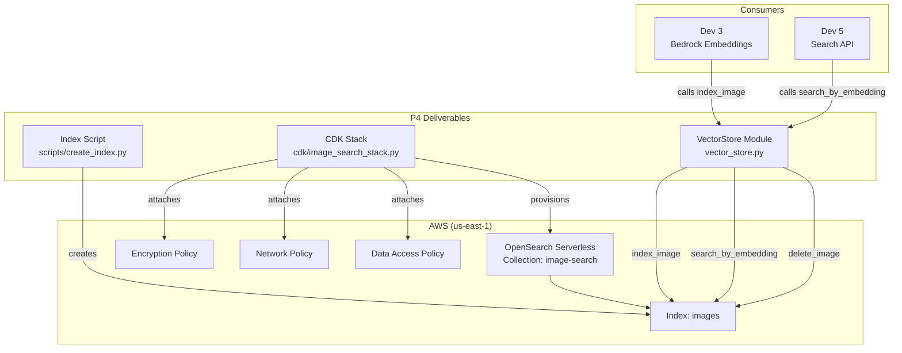

# Design Document: Vector Store + Schema Setup

## Overview

This component provisions and configures the vector storage layer for the Visual Project Intelligence Search system. It consists of three deliverables:

1. **CDK Stack** (`cdk/`) — AWS CDK (Python) that provisions an OpenSearch Serverless collection with all required security policies in `us-east-1`.
2. **Index Creation Script** (`scripts/create_index.py`) — A standalone Python script that creates the `images` index with the exact field mapping required by the system.
3. **VectorStore Client Module** (`vector_store.py`) — A Python helper module that wraps the OpenSearch Serverless client and exposes `index_image`, `search_by_embedding`, and `delete_image` for use by Dev 3 (Bedrock embeddings) and Dev 5 (Search API).

The design prioritises correctness of the embedding field configuration (cosine similarity, 1536 dimensions) and a clean, well-documented interface for downstream consumers.

---

## Architecture



---

## Components and Interfaces

### 1. CDK Stack (`cdk/image_search_stack.py`)

Provisions the following AWS resources using `aws-cdk-lib` v2:

| Resource | Type | Key Properties |
|---|---|---|
| `image-search` | `aws_opensearchserverless.CfnCollection` | `type=VECTORSEARCH` |
| Encryption Policy | `CfnSecurityPolicy` | `type=encryption`, AWS-owned KMS |
| Network Policy | `CfnSecurityPolicy` | `type=network`, public access |
| Data Access Policy | `CfnAccessPolicy` | `type=data`, `aoss:*` on all indexes |

Stack output: `CollectionEndpoint` — the HTTPS endpoint URL of the collection.

### 2. Index Creation Script (`scripts/create_index.py`)

A standalone Python script that:
- Reads the collection endpoint from the `OPENSEARCH_ENDPOINT` environment variable (or CLI argument).
- Authenticates using `boto3` + `opensearchpy.AWSV4SignerAuth`.
- Calls `client.indices.create()` with the mapping defined below.
- Skips gracefully if the index already exists (catches `RequestError` with status 400).

**Public function:**
```python
def build_index_mapping() -> dict:
    """Return the index settings and mappings dict for the 'images' index."""
```

### 3. VectorStore Module (`vector_store.py`)

```python
class VectorStore:
    def __init__(self, endpoint: str | None = None):
        """
        Initialise the VectorStore client.

        Parameters
        ----------
        endpoint : str, optional
            OpenSearch Serverless collection endpoint URL.
            Falls back to the OPENSEARCH_ENDPOINT environment variable.

        Raises
        ------
        ValueError
            If no endpoint is provided and OPENSEARCH_ENDPOINT is not set.
        """

    def index_image(
        self,
        image_id: str,
        project_id: str,
        embedding: list[float],
        tags: list[str],
        date: str,
        location: str,
    ) -> dict:
        """
        Index a single image document.

        Parameters
        ----------
        image_id : str
            Unique identifier for the image; used as the OpenSearch document _id.
        project_id : str
            Project the image belongs to.
        embedding : list[float]
            1536-dimensional float32 vector from Bedrock Titan Multimodal.
        tags : list[str]
            AI-generated or manual tags (e.g. ["bridge", "concrete crack"]).
        date : str
            ISO 8601 date string (e.g. "2024-04-15T08:30:00-07:00").
        location : str
            Human-readable location string (e.g. "Pier P-3, East Side").

        Returns
        -------
        dict
            The OpenSearch index API response.

        Raises
        ------
        ValueError
            If embedding does not have exactly 1536 dimensions.
        opensearchpy.OpenSearchException
            Re-raised after logging if the API call fails.
        """

    def search_by_embedding(
        self,
        embedding_vector: list[float],
        top_k: int = 10,
        filters: dict | None = None,
    ) -> list[dict]:
        """
        Search for images by vector similarity.

        Parameters
        ----------
        embedding_vector : list[float]
            1536-dimensional query embedding.
        top_k : int, optional
            Maximum number of results to return (default 10).
        filters : dict, optional
            OpenSearch bool filter clause dict, e.g.:
            {"term": {"project_id": "PROJ-001"}}
            or {"range": {"date": {"gte": "2024-01-01"}}}

        Returns
        -------
        list[dict]
            List of result dicts, each containing:
            image_id, project_id, tags, date, location, score.

        Raises
        ------
        ValueError
            If embedding_vector does not have exactly 1536 dimensions.
        opensearchpy.OpenSearchException
            Re-raised after logging if the API call fails.
        """

    def delete_image(self, image_id: str) -> dict:
        """
        Delete an image document from the index.

        Parameters
        ----------
        image_id : str
            The image_id (_id) of the document to delete.

        Returns
        -------
        dict
            The OpenSearch delete API response, or an empty dict if not found.

        Raises
        ------
        opensearchpy.OpenSearchException
            Re-raised after logging if the API call fails (excluding 404).
        """
```

---

## Data Models

### Index Mapping

```json
{
  "settings": {
    "index.knn": true
  },
  "mappings": {
    "properties": {
      "image_id":   { "type": "keyword" },
      "project_id": { "type": "keyword" },
      "embedding":  {
        "type":       "knn_vector",
        "dimension":  1536,
        "method": {
          "name":       "hnsw",
          "engine":     "faiss",
          "space_type": "cosine"
        }
      },
      "tags":     { "type": "keyword" },
      "date":     { "type": "date" },
      "location": { "type": "keyword" }
    }
  }
}
```

**Embedding field rationale:**
- `dimension: 1536` — matches `amazon.titan-embed-image-v1` output exactly.
- `space_type: cosine` — Bedrock Titan Multimodal embeddings are not unit-normalised, so cosine similarity (which normalises internally) is the correct metric. Using dot product on non-normalised vectors would produce incorrect rankings.
- `engine: faiss` — the recommended engine for OpenSearch Serverless vector search; `nmslib` is not supported in AOSS.
- `method: hnsw` — Hierarchical Navigable Small World graph; the standard approximate nearest-neighbour algorithm supported by AOSS.

### Document Shape (at index time)

```python
{
    "_id": "<image_id>",
    "_source": {
        "image_id":   "site-photo-01.jpg",
        "project_id": "PROJ-001",
        "embedding":  [0.012, -0.034, ...],  # 1536 floats
        "tags":       ["bridge", "concrete", "pier"],
        "date":       "2024-04-15T08:30:00-07:00",
        "location":   "Pier P-3, East Side"
    }
}
```

### Search Result Shape (returned by `search_by_embedding`)

```python
{
    "image_id":   "site-photo-01.jpg",
    "project_id": "PROJ-001",
    "tags":       ["bridge", "concrete", "pier"],
    "date":       "2024-04-15T08:30:00-07:00",
    "location":   "Pier P-3, East Side",
    "score":      0.9821
}
```

### OpenSearch Query Structure (with filters)

```json
{
  "size": 10,
  "query": {
    "knn": {
      "embedding": {
        "vector": [...],
        "k": 10,
        "filter": {
          "bool": {
            "filter": [
              { "term": { "project_id": "PROJ-001" } }
            ]
          }
        }
      }
    }
  }
}
```

---

## Correctness Properties

*A property is a characteristic or behavior that should hold true across all valid executions of a system — essentially, a formal statement about what the system should do. Properties serve as the bridge between human-readable specifications and machine-verifiable correctness guarantees.*

The VectorStore module contains pure-function logic (query construction, dimension validation, result mapping) that is well-suited to property-based testing using [Hypothesis](https://hypothesis.readthedocs.io/). The OpenSearch client calls are mocked so tests run in-memory at low cost.

The CDK stack and index creation script are IaC/configuration artefacts; they are tested via CDK snapshot assertions and example-based unit tests, not property-based tests.

---

### Property 1: Index round-trip preserves document data

*For any* valid image document (arbitrary `image_id`, `project_id`, 1536-dim `embedding`, `tags` list, ISO date string, `location` string), calling `index_image` followed by a `get` on the same `image_id` should return a document whose `_source` fields are equal to the values that were indexed.

**Validates: Requirements 3.1, 3.2, 5.2**

---

### Property 2: Re-indexing the same image_id is idempotent (overwrites)

*For any* `image_id` and two arbitrary valid document payloads `doc_a` and `doc_b`, calling `index_image` with `doc_a` and then `index_image` with `doc_b` (same `image_id`) should result in exactly one document in the index whose `_source` matches `doc_b`.

**Validates: Requirements 5.1**

---

### Property 3: Search results satisfy top_k bound and contain required fields

*For any* valid 1536-dimensional query embedding and any integer `top_k` ≥ 1, `search_by_embedding` should return a list of length at most `top_k`, and every element in the list should contain the keys `image_id`, `project_id`, `tags`, `date`, `location`, and `score`.

**Validates: Requirements 3.3, 5.2, 5.3**

---

### Property 4: Filter clause is correctly embedded in the kNN query

*For any* valid filter dict passed to `search_by_embedding`, the OpenSearch query body constructed by the VectorStore should contain a `bool.filter` clause whose content matches the provided filter, and the `knn` query should still be present at the top level.

**Validates: Requirements 3.4**

---

### Property 5: Delete round-trip removes the document; deleting non-existent image is safe

*For any* `image_id`, after calling `index_image` followed by `delete_image` with the same `image_id`, a subsequent `get` should return a not-found response. Additionally, calling `delete_image` with an `image_id` that was never indexed should not raise an exception.

**Validates: Requirements 3.5, 5.4**

---

### Property 6: Embedding dimension validation rejects non-1536-length inputs

*For any* list whose length is not exactly 1536, calling `index_image` or `search_by_embedding` with that list as the embedding argument should raise a `ValueError` before any network call is made.

**Validates: Requirements 5.5**

---

### Property 7: All VectorStore operations log and re-raise OpenSearch exceptions

*For any* VectorStore operation (`index_image`, `search_by_embedding`, `delete_image`) and any `OpenSearchException` raised by the underlying client, the VectorStore should log an error message containing the operation name and exception detail, and then re-raise the same exception type.

**Validates: Requirements 3.8**

---

## Error Handling

| Scenario | Handling |
|---|---|
| `embedding` length ≠ 1536 | Raise `ValueError` immediately in `index_image` / `search_by_embedding` before any I/O |
| OpenSearch API error (4xx/5xx) | Catch `opensearchpy.OpenSearchException`, log `ERROR` with operation name + detail, re-raise |
| Index already exists (script) | Catch `RequestError` with status 400, log `INFO "Index already exists, skipping"`, continue |
| `delete_image` on missing doc | Catch `NotFoundError` (404), return empty dict, do not re-raise |
| Missing endpoint configuration | Raise `ValueError` in `VectorStore.__init__` with clear message |
| Missing AWS credentials | Let `boto3` raise `NoCredentialsError` naturally (not caught — caller must configure credentials) |

---

## Testing Strategy

### Unit Tests (example-based)

- **Mapping dict correctness**: Assert `build_index_mapping()` returns a dict with the exact structure shown in the Data Models section (field types, dimension, space_type, engine, knn setting).
- **Index-already-exists skip**: Mock the OpenSearch client to raise `RequestError(400)` and assert the script logs and continues without raising.
- **Endpoint configuration**: Assert `VectorStore` raises `ValueError` when neither constructor arg nor env var is set; assert it uses the constructor arg when provided; assert it falls back to env var.
- **Delete non-existent**: Mock client to return 404 and assert `delete_image` returns an empty dict without raising.

### Property-Based Tests (Hypothesis)

Each property maps to a single Hypothesis test. The OpenSearch client is replaced with a mock (e.g., `unittest.mock.MagicMock`) so tests run in-memory.

| Property | Hypothesis Strategy |
|---|---|
| P1: Index round-trip | `st.text()` for string fields, `st.lists(st.floats(), min_size=1536, max_size=1536)` for embedding, `st.lists(st.text())` for tags |
| P2: Idempotent re-index | Same as P1, generate two document payloads sharing one `image_id` |
| P3: Search top_k + result fields | `st.integers(min_value=1, max_value=100)` for top_k, mock client returns N results |
| P4: Filter query construction | `st.dictionaries(st.text(), st.text())` for filter; inspect constructed query body |
| P5: Delete round-trip + safe delete | `st.text()` for image_id; mock client tracks indexed docs |
| P6: Dimension validation | `st.lists(st.floats()).filter(lambda x: len(x) != 1536)` |
| P7: Exception propagation | `st.sampled_from([OpenSearchException, TransportError])` for exception type |

**Configuration**: Each Hypothesis test runs with `@settings(max_examples=100)`.

**Tag format**: Each test is annotated with a comment:
```python
# Feature: vector-store-setup, Property N: <property_text>
```

### CDK Snapshot Tests

Use `aws_cdk.assertions.Template.from_stack()` to assert:
- Collection resource exists with `Type: VECTORSEARCH`.
- Three security policy resources exist (encryption, network, data access).
- Stack output `CollectionEndpoint` is present.

### Integration Tests (manual / CI with real AOSS)

- Deploy the CDK stack to a sandbox account.
- Run `create_index.py` and verify the index exists via the OpenSearch API.
- Call `index_image` with a sample document and verify retrieval.
- Run `search_by_embedding` with a random vector and verify the response shape.
